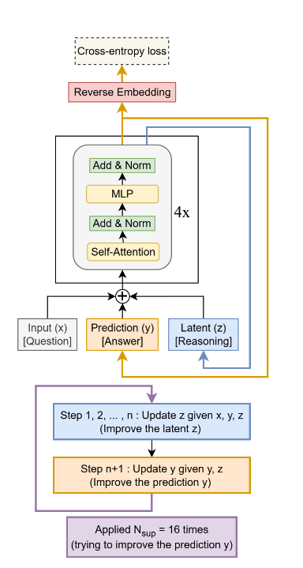

# TRM Architecture Document

## 1. High-Level Design (HLD)

### 1.1 System Overview

```
┌─────────────────────────────────────────────────────────────────────┐
│                    TRM Educational Gaming Platform                   │
├─────────────────────────────────────────────────────────────────────┤
│  ┌──────────────┐  ┌──────────────┐  ┌──────────────┐              │
│  │ Sudoku Forge │  │Maze Navigator│  │ARC Abstracter│   GAMES      │
│  └──────┬───────┘  └──────┬───────┘  └──────┬───────┘              │
│         │                 │                 │                       │
│  ┌──────┴─────────────────┴─────────────────┴──────┐               │
│  │              TRM Inference Engine                │   CORE AI    │
│  │         (Recursive Reasoning Model)              │               │
│  └──────────────────────┬───────────────────────────┘               │
│                         │                                           │
│  ┌──────────────────────┴───────────────────────────┐               │
│  │              Data Generation Layer               │   DATA       │
│  │      (Sudoku/Maze/ARC Puzzle Generators)         │               │
│  └──────────────────────────────────────────────────┘               │
└─────────────────────────────────────────────────────────────────────┘
```

### 1.2 Component Diagram

```
                    ┌─────────────────┐
                    │   User Input    │
                    │  (Puzzle Grid)  │
                    └────────┬────────┘
                             │
                    ┌────────▼────────┐
                    │   Embedding     │
                    │  (Token → D)    │
                    └────────┬────────┘
                             │
              ┌──────────────┼──────────────┐
              │              │              │
        ┌─────▼─────┐  ┌─────▼─────┐  ┌─────▼─────┐
        │  x (Input)│  │ y (Output)│  │ z (Latent)│
        │   [B,L,D] │  │   [B,L,D] │  │   [B,L,D] │
        └─────┬─────┘  └─────┬─────┘  └─────┬─────┘
              │              │              │
              └──────────────┼──────────────┘
                             │
                    ┌────────▼────────┐
                    │  Deep Recursion │
                    │   (T cycles)    │
                    └────────┬────────┘
                             │
              ┌──────────────┼──────────────┐
              │                             │
        ┌─────▼─────┐                 ┌─────▼─────┐
        │Output Head│                 │ Halt Head │
        │  (y_hat)  │                 │  (q_hat)  │
        └───────────┘                 └───────────┘
```

---


## 2. Low-Level Design (LLD)

### 2.0 Visual Architecture Reference


### 2.1 TinyNet Architecture

```
┌─────────────────────────────────────────────────────────┐
│                     TinyNet (5M params)                  │
├─────────────────────────────────────────────────────────┤
│  Input: [B, L, D=512]                                   │
│                                                          │
│  ┌─────────────────────────────────────────────────┐    │
│  │  TinyBlock × 2                                   │    │
│  │  ┌─────────────────────────────────────────┐    │    │
│  │  │ RMSNorm → TinyAttention → Dropout       │    │    │
│  │  │     ↓                                    │    │    │
│  │  │ RMSNorm → SwiGLU FFN → Dropout          │    │    │
│  │  └─────────────────────────────────────────┘    │    │
│  └─────────────────────────────────────────────────┘    │
│                                                          │
│  Output: [B, L, D=512]                                  │
└─────────────────────────────────────────────────────────┘
```

### 2.2 Component Specifications

| Component | Parameters | Description |
|-----------|------------|-------------|
| **RMSNorm** | D | Root Mean Square normalization (no bias) |
| **RoPE** | D/2 | Rotary Positional Encoding |
| **SwiGLU** | 3×D×H | Swish-Gated Linear Unit (H = 2/3×4×D) |
| **TinyAttention** | 4×D² | Multi-head attention (8 heads) |

### 2.3 Recursion Flow

```
Algorithm: Deep Recursion (Paper Version)

Input: x (puzzle), y (solution), z (latent)
Parameters: n (latent steps), T (recursion cycles)

def latent_recursion(x, y, z, n):
    for i in range(n):
        z = net([x, y, z])  # Improve latent reasoning
    y = net([y, z])         # Refine solution
    return y, z

def deep_recursion(x, y, z, n, T):
    # T-1 Warmup cycles (no gradients)
    with torch.no_grad():
        for j in range(T-1):
            y, z = latent_recursion(x, y, z, n)
            
    # Final cycle (with gradients)
    y, z = latent_recursion(x, y, z, n)
    
    return y, z, output_head(y), halt_head(y)
```

### 2.4 Deep Supervision (Paper vs Implementation)

**Paper Algorithm (Ideal):**
```python
# Deep Supervision Loop (from Paper)
y, z = y_init, z_init
for step in range(N_sup):
    x = input_embedding(x_input)
    (y, z), y_hat, q_hat = deep_recursion(x, y, z)
    loss = cross_entropy(y_hat, y_true)
    loss.backward()
    if q_hat > 0: break
```

**Current Implementation (`src/training/trainer.py`):**
*   Currently implements a **single pass** of `deep_recursion` per batch (`N_sup=1` equivalent).
*   The `DeepRecursion` module handles the `T` internal cycles (with T-1 no-grad).
*   *Note: Full N_sup iterative training loop is pending implementation to match the paper exactly.*


---

## 3. Legends

| Symbol | Meaning |
|--------|---------|
| B | Batch size |
| L | Sequence length (81 for Sudoku) |
| D | Hidden dimension (512) |
| T | Recursion cycles (3) |
| n | Latent updates per cycle (6) |
| → | Data flow |
| ─ | Connection |

---

## 4. Technology Stack

| Layer | Technology |
|-------|------------|
| Language | Python 3.10+ |
| Framework | PyTorch 2.0+ |
| Training | AdamW, AMP, EMA |
| Data | JSON, NumPy |
| Logging | WandB (optional) |

---

## 5. File Structure

```
TRM/
├── src/
│   ├── model/
│   │   ├── tiny_net.py     # TinyNet, RMSNorm, RoPE, SwiGLU
│   │   ├── recursion.py    # LatentRecursion, DeepRecursion, TRMModel
│   │   └── heads.py        # OutputHead, HaltHead
│   ├── data/
│   │   ├── sudoku.py       # Puzzle generator
│   │   ├── maze.py         # Maze generator
│   │   └── dataset.py      # DataLoader
│   ├── training/
│   │   ├── trainer.py      # Training loop
│   │   └── losses.py       # Loss functions
│   └── train.py            # CLI entry point
├── configs/
│   └── sudoku_baseline.yaml
├── outputs/
│   └── *.pt                # Checkpoints
└── docs/
    └── architecture.md     # This document
```
